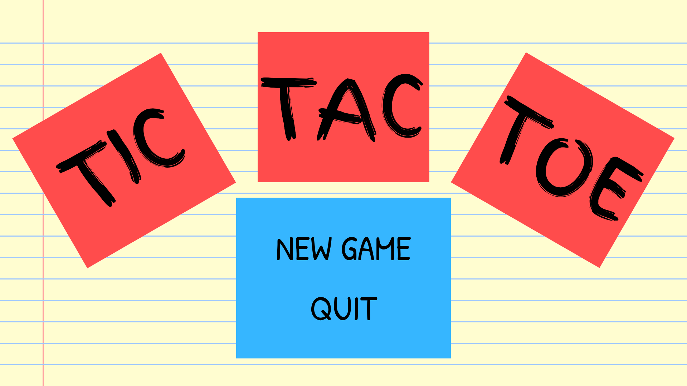
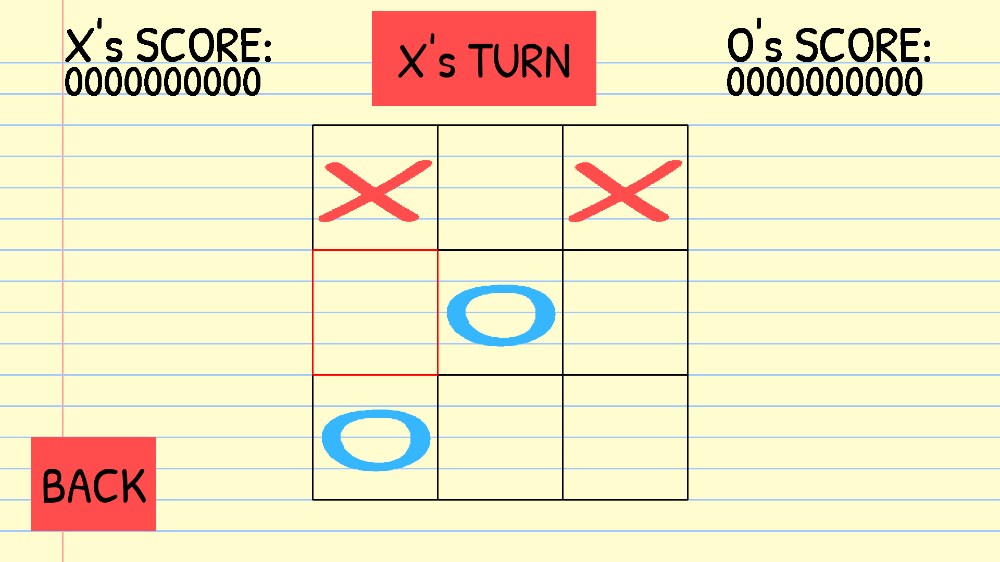

# Tic Tac Toe

***To anyone who might be reading this code:***

*This is my first programming project outside of courses and algorithmic exercises. 
The code is not well-written, and I am aware that there are many areas for improvement. 
I appreciate your understanding and patience.*

## Screenshots
### Main Menu

### In-Game

### Game Over

## Features
- **User-Friendly Interface**: Simple and intuitive paper like UI for easy gameplay.
- **Two-Player Mode**: Play against a friend on the same computer.
- **Turn-Based Gameplay**: Players take turns on the same computer.
- **Winning Detection**: Automatically detects when a player wins or when the game ends in a draw.

## Installation
1. **Download the setup file**:
    - Download the setup file from [here](path_to_your_setup_file).

2. **Run the setup file**:
    - Double-click the setup file and follow the installation instructions.

3. **Launch the game**:
    - After installation, run the Tic Tac Toe game from the shortcut created on your desktop or start menu.

## How to Play:
  - The game board is a 3x3 grid.
  - Player 1 is 'X' and Player 2 is 'O'.
  - Players take turns placing their mark in an empty cell on the same computer.
  - The first player to get three of their marks in a row (horizontally, vertically, or diagonally) wins.
  - If all cells are filled and no player has three marks in a row, the game ends in a draw.

## Development
- **Technologies Used**:
    - Python 3.12.7
    - Pygame-ce 2.5.1

## Credits
- **Developer**: [Ernest M.](https://github.com/ernest-mm)
- **Special Thanks**: 
  - Pygame Community for the excellent documentation and resources.
- **Sound Effects**:
  - Paper_Flip_01 by Rookster - [Link](https://freesound.org/s/615337/) - License: Attribution 4.0
  - pen (marker pen) writes on paper by SSkiba88 - [Link](https://freesound.org/s/751055/) - License: Creative Commons 0

## License
This project is licensed under the MIT License - see the [LICENSE](LICENSE) file for details.
